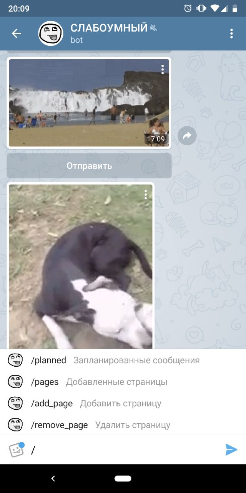
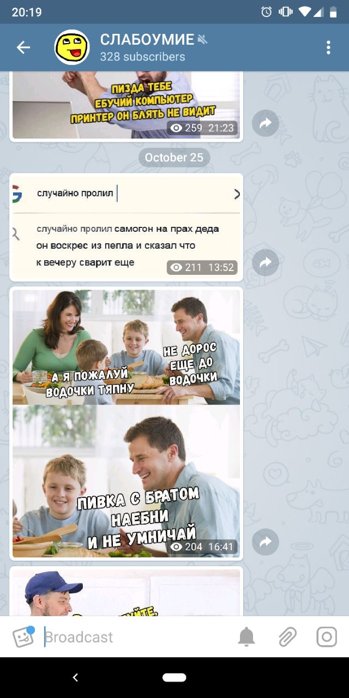

# vk-to-tg

Grub vk publics posts and publish them in your telegram channel with moderation through telegram bot.

## How to start

1) npm install
2) set your tokens in docker-compose.yml
3) ./setup.sh

## What can it do?

1) View planned messages
2) View added VK publics
3) Add VK public
4) Remove VK public
5) When publishing a new post, the post is added to the queue. Posts are published with a frequency of 2 to 3 hours.

## Screenshots

